# SAEDevAppSecu  
# Version: 1.0.0

- [SAEDevAppSecu](#saedevappsecu)
- [Version: 1.0.0](#version-100)
- [What is it ?](#what-is-it-)
- [How to create an account](#how-to-create-an-account)
- [How to Sign in](#how-to-sign-in)
- [How to see your profile](#how-to-see-your-profile)
- [How to search a series](#how-to-search-a-series)
- [How to see the details of a series](#how-to-see-the-details-of-a-series)
- [How to add a series to your favorites](#how-to-add-a-series-to-your-favorites)
- [How to delete a series from you favorites](#how-to-delete-a-series-from-you-favorites)
- [How to watch an episode of a series](#how-to-watch-an-episode-of-a-series)
- [How to access the comments of a series](#how-to-access-the-comments-of-a-series)
- [How to add a comment to a series](#how-to-add-a-comment-to-a-series)
- [How to disconnect](#how-to-disconnect)

# What is it ?

 NetVod is a service which is like Netflix but without budget. You can se the detail of the series, add them to your favorites, watch the episodes and comment them. You also have a search bar which help you to find the series you want to watch.

# How to create an account

> 1. Go to the website [SAEDevAppSecu](https://webetu.iutnc.univ-lorraine.fr/~mingot2u/)
> 2. Click on the button "Créer un compte"
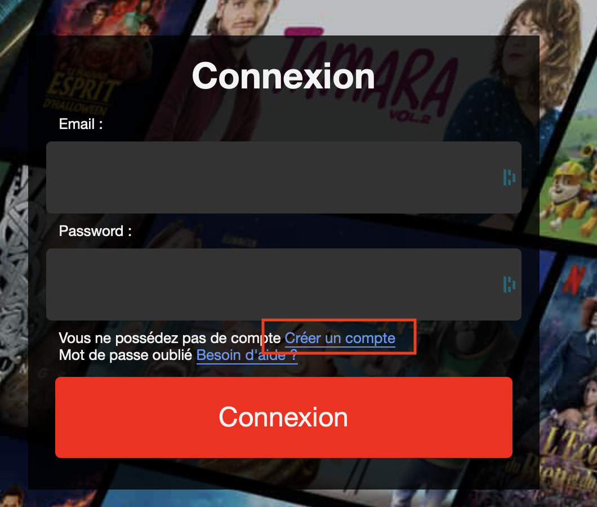
> 3. Fill the form with your informations
> First : Email  
> Then : Password and confirm it  
> Then : your Name and your First Name  
> To finish : Tick your gender then click on the button "Inscription"
> 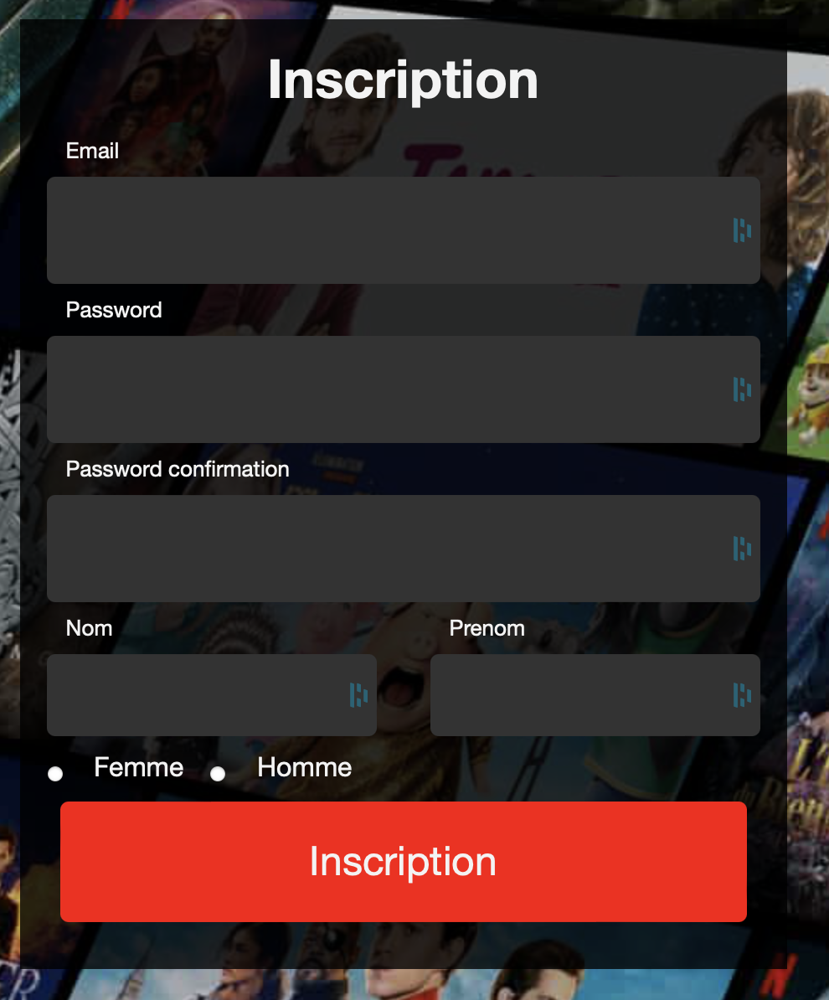
> To finish creating your account, you will need to click on the only button you can click in order to activate your account.
> 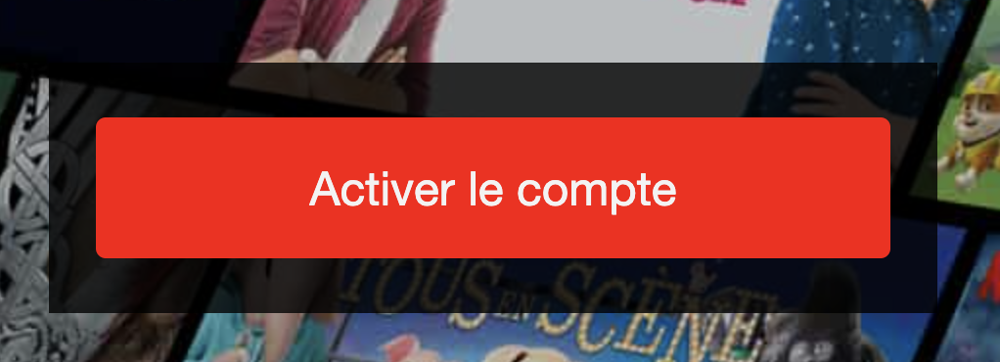

# How to Sign in

> 1. Go to the website [SAEDevAppSecu](https://webetu.iutnc.univ-lorraine.fr/~mingot2u/)
> Enter your mail and password then click on "Connexion"
> 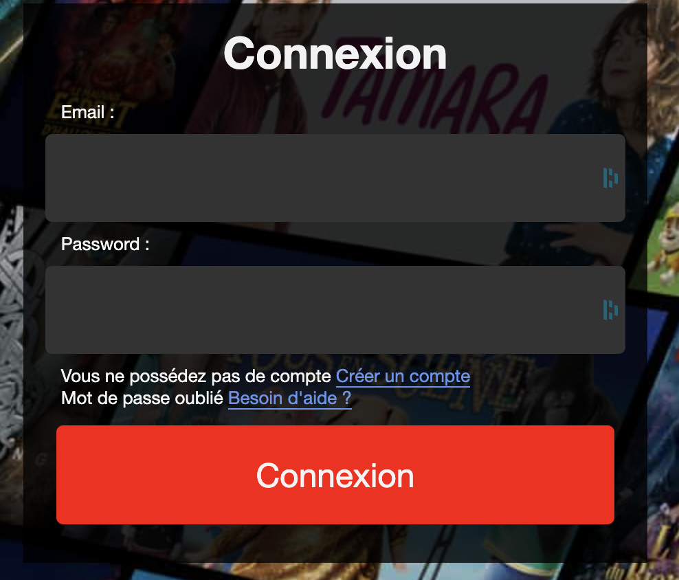
> Voila ! You are now connected to the website.

# How to see your profile

> Once you are Signed In, you just have to click on the profil logo which is located in the top right hand corner of the website.
> 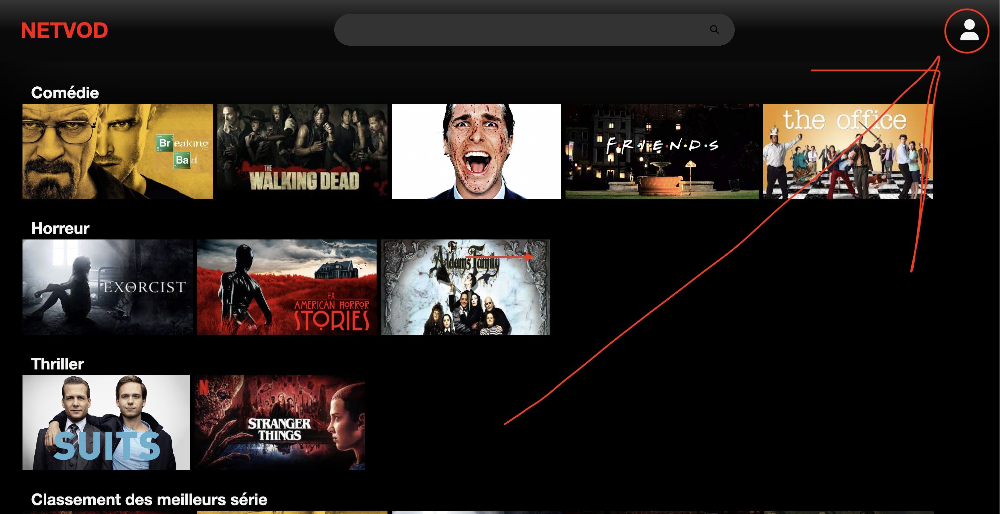
> And the your profile information will be available.
> 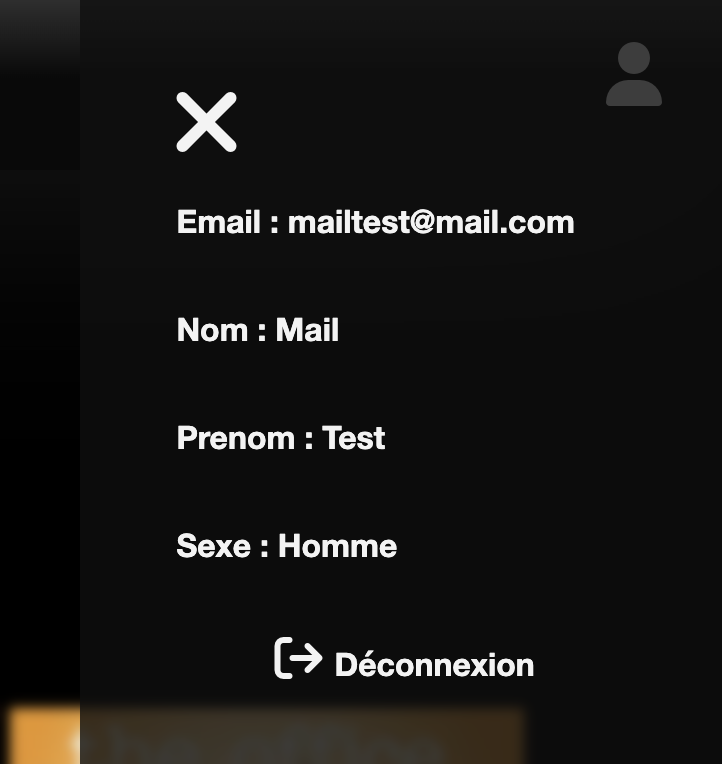

# How to search a series 

> Once you are signed in, you just have to click on the search bar which is located at the top of the website.   
> Write the name of the series you want to search and press enter.
> 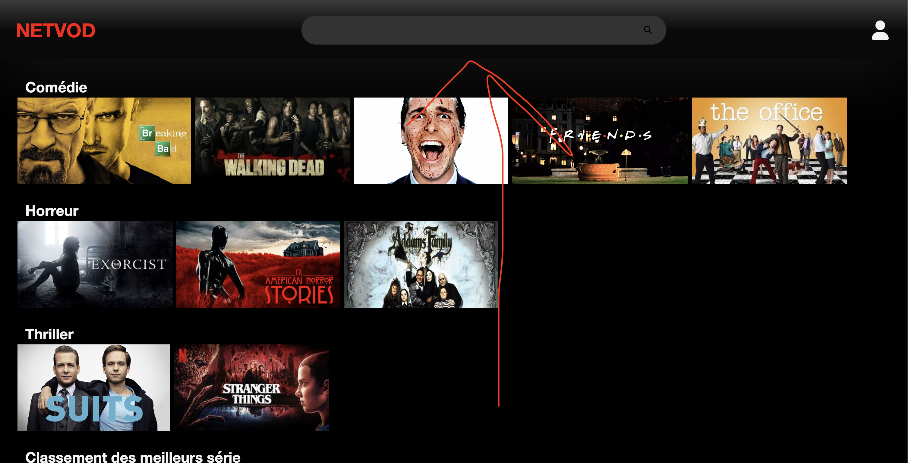

# How to see the details of a series

> You just have to click on the series you want to see the details of.

# How to add a series to your favorites

>Once you see the details of the series, you just have to click on the favourite button which is located at the right of the page.
> 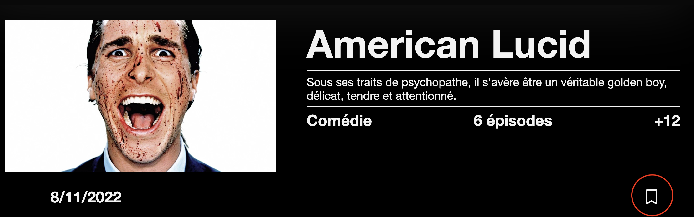
> Now if the button is yellow, it means that the series is in your favorites.
> 

# How to delete a series from you favorites

> If the series is in your favorites, you just have to click on the button which is located at the right of the page, that will delete the series from your favorites.

# How to watch an episode of a series

> Once you are on the details of a series, you just have to click on the episode you want to watch, and voila !

# How to access the comments of a series

> Scroll down a little from the details of the series, and you will see the button 'Commentaire'
> 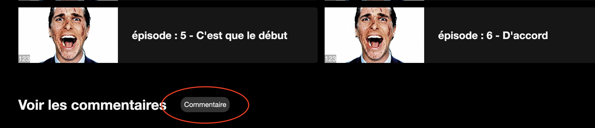
> Then you will see the comments of the series.

# How to add a comment to a series

> Once you are on the comments of a series, you just have to click on the star you want to give as a note, and write your point of view. When you're finish, just press enter and the comment will be added to the series.
> 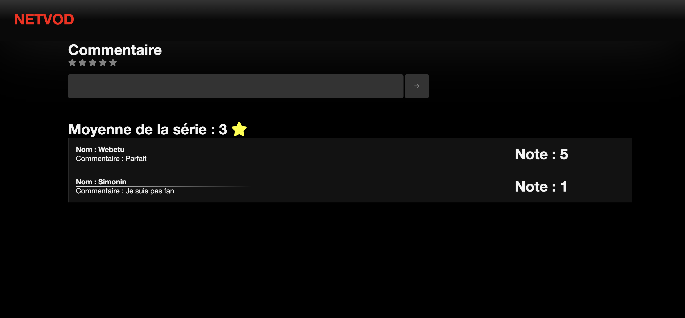

# How to disconnect 
> You just have to click on the button Déconnexion which is located in the profile section.
> 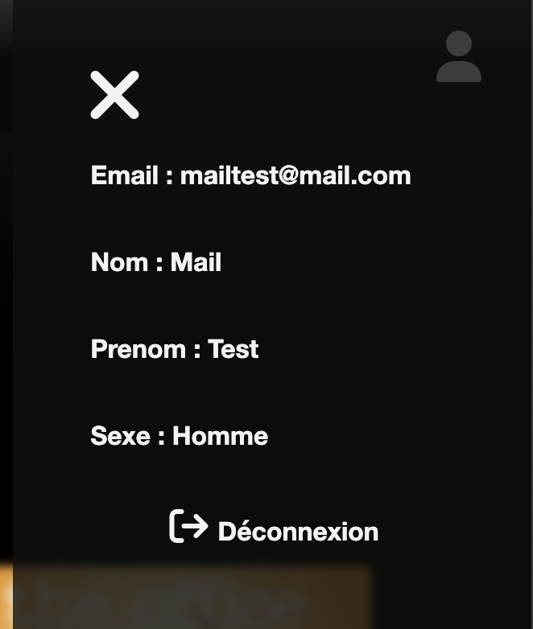